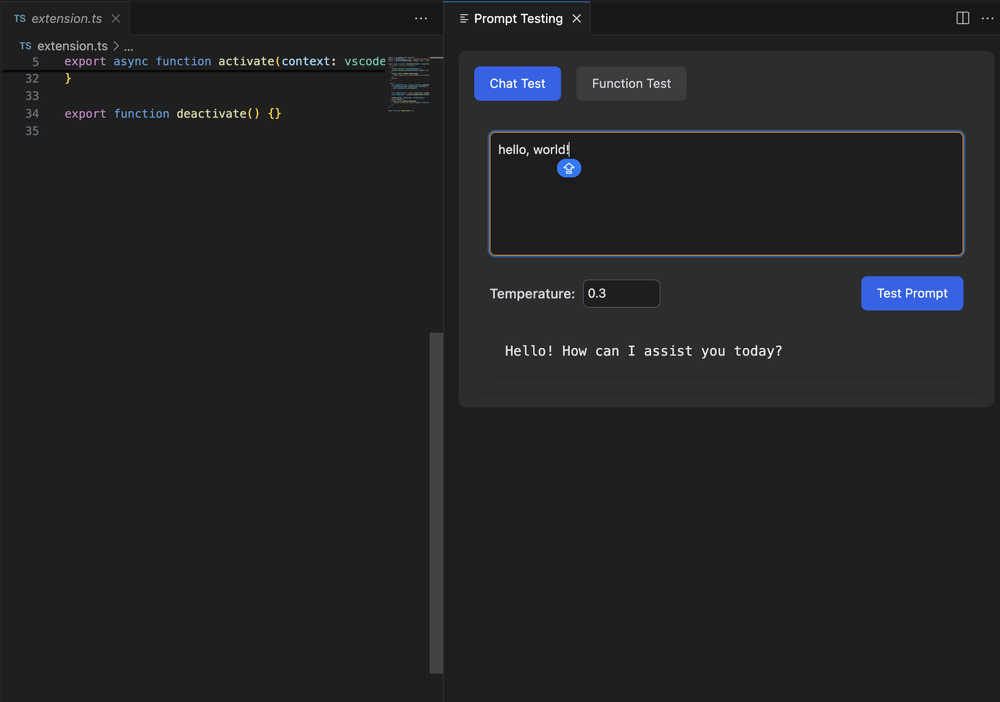
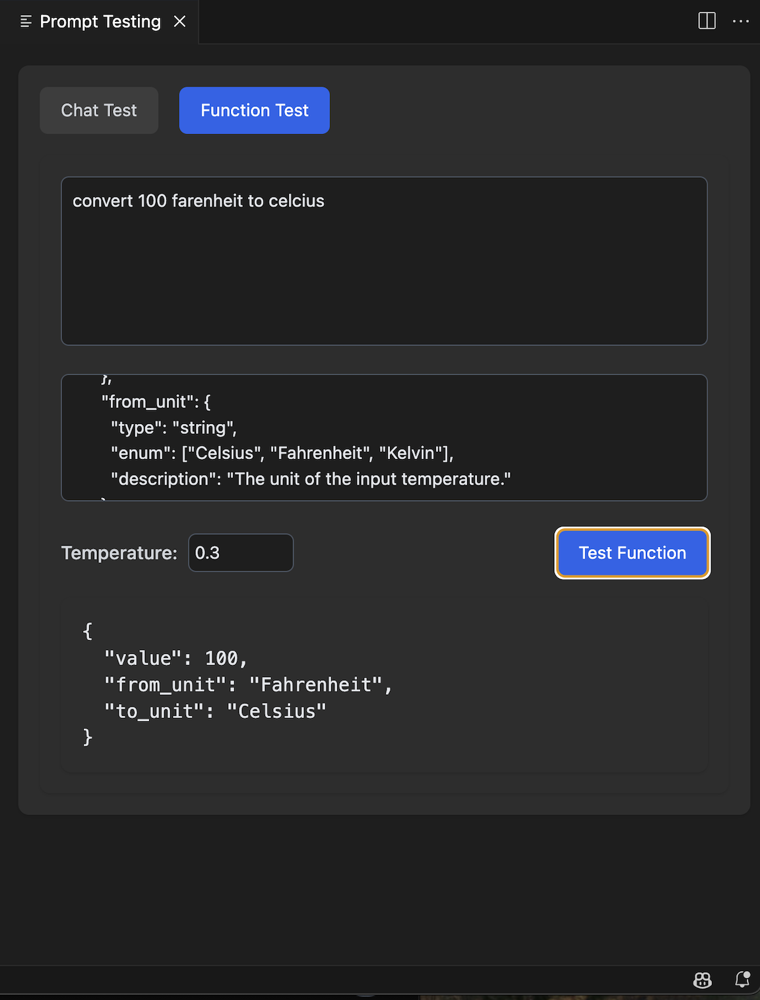
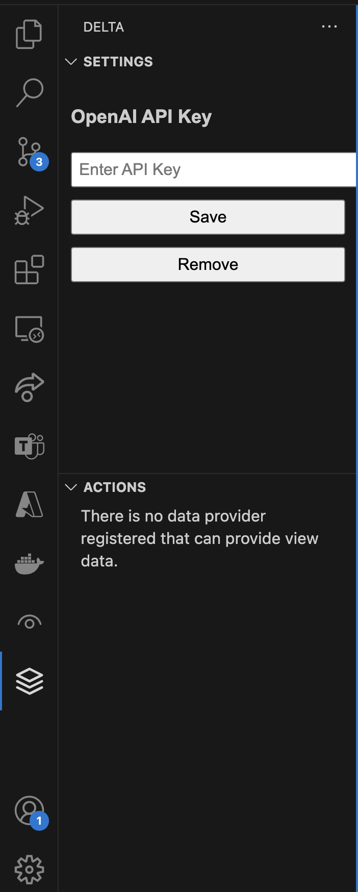

# Delta

An Open-source AI-powered code review/testing assistant for Visual Studio Code that provides intelligent feedback on your code changes and prompt testing for LLM.

## Screenshots

|           Prompt Testing Panel            |           Function Testing Panel            |         Settings Sidebar         |
| :---------------------------------------: | :-----------------------------------------: | :------------------------------: |
|  |  |  |

Each panel can be accessed through:

- Prompt Testing: `Ctrl+Alt+P` (Windows/Linux) or `Cmd+Alt+P` (Mac)
- Function Testing: Switch mode in the prompt testing panel
- Settings: Click on the Delta icon in the sidebar

## Usage

### Test Prompt

1. Use the keyboard shortcut `Ctrl+Alt+P` (Windows/Linux) or `Cmd+Alt+P` (Mac)
2. Or click the "Test Prompt" button in the sidebar
3. View the AI-generated response in a new panel

## Extension Settings

- `openai-api-key`: Your OpenAI API key (stored securely in your local computer)

### Review Code Changes

1. Make changes to your code
2. Use the keyboard shortcut `Ctrl+Shift+R` (Windows/Linux) or `Cmd+Shift+R` (Mac)
3. Or click the "Review Code Changes" button in the sidebar
4. View the AI-generated code review in a new panel

## Features

### Prompt Testing

- Support for both chat completion and function calls
- Adjustable temperature settings
- Real-time response streaming
- Custom function parameters
- Persistent history

- 🤖 AI-powered code review
- 🔍 Analyzes code changes in real-time
- 🛡️ Security vulnerability detection
- 💡 Best practices suggestions
- 📊 Code complexity assessment
- 🔑 Secure API key management

## Requirements

- Visual Studio Code 1.80.0 or higher
- Git installed and initialized in your workspace
- OpenAI API key

## Installation

1. Install the extension from the VS Code marketplace
2. Click on the AI Code Review icon in the sidebar
3. Enter your OpenAI API key in the settings panel

## Known Issues

Please report issues on our [GitHub repository](https://github.com/GeLi2001/Delta/issues).

## Release Notes

### 0.0.12

- Added function testing feature
- Add React UI

## License

MIT

